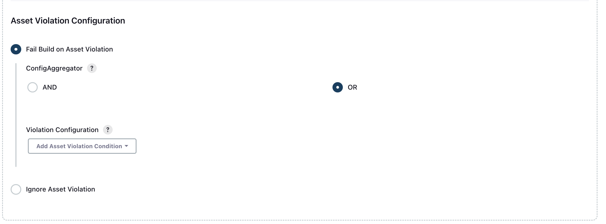
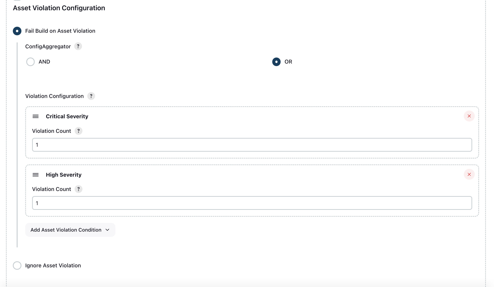

<!--
 Copyright 2024 Google LLC

 Licensed under the Apache License, Version 2.0 (the "License");
 you may not use this file except in compliance with the License.
 You may obtain a copy of the License at

     https://www.apache.org/licenses/LICENSE-2.0

 Unless required by applicable law or agreed to in writing, software
 distributed under the License is distributed on an "AS IS" BASIS,
 WITHOUT WARRANTIES OR CONDITIONS OF ANY KIND, either express or implied.
 See the License for the specific language governing permissions and
 limitations under the License.
-->

# Google Analyze Code Security

The Google Analyze Code Security plugin for Jenkins identifies insecure configurations in Infrastructure as Code (IaC) files for Google Cloud resources. This plugin requires Terraform plan files in JSON format for scanning.

## Set up credentials

### Service Account Based Credential

1. In the Google Cloud organization which includes the resources that you want to change, create a [service account](https://cloud.google.com/iam/docs/service-accounts-create).
1. Add the `Security Posture Admin` role or the `Security Posture Shift-Left Validator` role to the service account.
1. Create the [service account key](https://cloud.google.com/iam/docs/keys-create-delete#creating) in JSON format and download the JSON file.

## Configure the plugin

1. In the Jenkins console, click `Manage Jenkins` > `Configure System`.
1. In the **Google Analyze Code Security** section, click **Add** to add the service account key.
   
1. Add the service account key.
   
   * `OrganizationId`: Enter the organization ID for the Google Cloud organization that includes the resources.
   * `SCC Credentials`: Add the service account key.
1. [Optional] To validate the credentials, click **Test Connection**.
1. To add additional service account keys, click **Add**.
1. Click **Save**.

## Add the plugin to your build project

1. In the Jenkins console, click **Corresponding Project** > **Configuration**.
1. Click **Add build step** > **Perform Code Scan during Build**.
   
1. Complete the following fields:
   
   * **OrganizationID**: The Google Cloud organization ID.
   * **Scan File Name**: The name of the Terraform plan file (in JSON format) that you want to scan. The plugin scans the workspace directory and its subdirectories for the file, if you don’t enter a {Scan File Path}.
   * **Scan File Path [Optional]**: The path to the JSON plan file, relative to the project workspace directory. For example, if the file is located in `/xyz/abc/myplanfile.json`, the file path is `/xyz/abc`.
   * **Scan Time Out[Millisecond]**: The time after which the plugin stops and changes the build status to failure.
   * **Plugin Failure Configuration**: Determines build status when the plugin runs into an error. If you set this field to `true`, the build status is marked as `SUCCESS`. Otherwise, if you set this field to `false`, the build status is marked as `FAILED`.
1. Complete one of the following actions to determine how a build proceeds:
   * To configure a build to fail depending on how many issues are found, complete the following:
     
       * Click `Add Asset Violation Config`.
       * Select a severity class and enter a corresponding violation count threshold.
       * Select the aggregator value (either **OR** or **AND**). 
         Sample Configuration:
         
   * To configure a build to finish, regardless of the number of issues found, select **Ignore violations reported in the Code Scan while evaluating build Status**.
       
1. Click **Save**.
1. To run the project, click **Build Now**.
1. To view the plugin report, click the most recent workflow.  
   * If the plugin ran, it publishes a violation report under **Build Artifacts**.   
   * If the plugin failed, it publishes an error report under **Build Artifacts**. 